# Agentic SDLC Dependency & Interaction Map

This document formalizes the topological execution order, data dependencies, approval blockers, and feedback loops across the 27 standardized GitHub Copilot engineering agents (`.github/agents/*.agent.md`).

---

## 1. Global Agent Dependency & Handoff Graph

```mermaid
flowchart TD
    %% Global Orchestration
    ORCH[software-engineering-orchestrator.agent.md<br/>Software Engineering Orchestrator]

    %% Product & Requirements Cluster
    subgraph Phase_Requirements ["Phase 1: Product & Requirements (GATE-01)"]
        PROD[product-manager.agent.md<br/>Product Manager]
        BA[business-analyst.agent.md<br/>Business Analyst]
        REQ[requirements-engineer.agent.md<br/>Requirements Engineer]
        VAL[requirements-validator.agent.md<br/>Requirements Validator]
        
        PROD -->|PRD & Vision| BA
        BA -->|BPMN & User Stories| REQ
        REQ -->|Draft SRS & Gherkin| VAL
        VAL -->|GATE-01 Verification| G1{GATE-01: Requirements}
    end

    %% Architecture & Design Cluster
    subgraph Phase_Architecture ["Phase 2: Architecture & Design (GATE-02)"]
        SOL[solution-architect.agent.md<br/>Solution Architect]
        ARCH[software-architect.agent.md<br/>Software Architect]
        REV[architecture-reviewer.agent.md<br/>Architecture Reviewer]
        HLD[hld-designer.agent.md<br/>HLD Designer]
        LLD[lld-designer.agent.md<br/>LLD Designer]
        
        G1 -->|Approved SRS| SOL
        SOL -->|Ecosystem Context| ARCH
        ARCH -->|ADRs & Architecture Blueprint| REV
        REV -->|GATE-02 Signoff| G2{GATE-02: Architecture}
        G2 -->|Topology & Guidelines| HLD
        HLD -->|Component Models & Sequences| LLD
    end

    %% Data & Interface Specification Cluster
    subgraph Phase_Specs ["Phase 3: Data & Interface Contracts (GATE-03)"]
        DBDES[database-designer.agent.md<br/>Database Designer]
        DBDEV[database-developer.agent.md<br/>Database Developer]
        APIDES[api-designer.agent.md<br/>API Designer]
        INTDES[integration-designer.agent.md<br/>Integration Designer]
        
        LLD -->|Entity Models| DBDES
        DBDES -->|ERD & Schema Strategy| DBDEV
        LLD -->|Service Contracts| APIDES
        APIDES -->|OpenAPI Specs| INTDES
        DBDEV -->|Flyway/DDL Migrations| G3{GATE-03: Design & Contracts}
        INTDES -->|Integration Workflows| G3
    end

    %% Engineering & Development Cluster
    subgraph Phase_Development ["Phase 4: Development & Implementation (GATE-04)"]
        FE[frontend-developer.agent.md<br/>Frontend Developer - Angular]
        BE[backend-developer.agent.md<br/>Backend Developer - Spring Boot]
        AI[ai-engineer.agent.md<br/>AI & LLM Engineer]
        
        G3 -->|OpenAPI & UI Wireframes| FE
        G3 -->|DTOs, Entities & Flyway| BE
        G3 -->|RAG Specs & Prompt Templates| AI
        
        FE --> G4{GATE-04: Clean Build}
        BE --> G4
        AI --> G4
    end

    %% Quality & Security Cluster
    subgraph Phase_Quality ["Phase 5: Quality, Review & DevSecOps (GATE-05 to GATE-08)"]
        CR[code-reviewer.agent.md<br/>Code Reviewer]
        QA[test-engineer.agent.md<br/>Test Engineer]
        SEC[security-engineer.agent.md<br/>Security Engineer]
        PERF[performance-engineer.agent.md<br/>Performance Engineer]
        
        G4 -->|Diffs & Pull Requests| CR
        CR -->|Approved PR| G5{GATE-05: Code Review}
        G5 -->|Test Target Artifacts| QA
        QA -->|Coverage >= 80% & Zero Regressions| G6{GATE-06: Testing}
        G6 -->|SAST/SCA/Secret Scans| SEC
        SEC -->|Zero High/Crit CVEs| G7{GATE-07: Security}
        G7 -->|Load & Stress Testing| PERF
        PERF -->|Latency P99 < 200ms| G8{GATE-08: Performance}
    end

    %% Platform, Release & SRE Cluster
    subgraph Phase_Delivery ["Phase 6: Platform, Release & Operations (GATE-09 & GATE-10)"]
        OPS[devops-engineer.agent.md<br/>DevOps Platform Engineer]
        CLOUD[cloud-engineer.agent.md<br/>Cloud & K8s Engineer]
        DOC[documentation-engineer.agent.md<br/>Documentation Engineer]
        REL[release-manager.agent.md<br/>Release Manager]
        SRE[sre-engineer.agent.md<br/>Site Reliability Engineer]
        INC[incident-manager.agent.md<br/>Incident Manager]
        
        G8 -->|CI Build & Containerization| OPS
        OPS -->|K8s Manifests & Helm Charts| CLOUD
        G8 -->|Docs, OpenAPI & Release Notes Sync| DOC
        CLOUD --> G9{GATE-09: Release Readiness}
        DOC --> G9
        G9 -->|Human Approval Signed| REL
        REL -->|Canary Deployment| G10{GATE-10: Production}
        G10 -->|Telemetry, SLOs & Runbooks| SRE
        SRE -.->|Incident / Anomaly Alert| INC
    end

    %% Feedback and Remediation Loops
    VAL -.->|Requirement Ambiguity / INVEST Failure| REQ
    REV -.->|Architecture Violation / Tech Risk| ARCH
    CR -.->|Rejection & Code Fix Request| FE
    CR -.->|Rejection & Code Fix Request| BE
    QA -.->|Bug / Test Assertion Failure| BE
    QA -.->|UI Test Failure| FE
    SEC -.->|Vulnerability Detected| BE
    SEC -.->|Container Image Vulnerability| OPS
    PERF -.->|Slow Query / Indexing Issue| DBDEV
    INC -.->|Post-Mortem Actions| ORCH

    %% Orchestrator Governance
    ORCH -.->|Supervises & Coordinates| Phase_Requirements
    ORCH -.->|Supervises & Coordinates| Phase_Architecture
    ORCH -.->|Supervises & Coordinates| Phase_Specs
    ORCH -.->|Supervises & Coordinates| Phase_Development
    ORCH -.->|Supervises & Coordinates| Phase_Quality
    ORCH -.->|Supervises & Coordinates| Phase_Delivery
```



---

## 2. Gate Blocker & Rejection Feedback Matrix

When a quality gate fails, automated execution halts and control routes to the designated remediation agent:

| Failing Gate | Blocker Reason | Remediation Agent | Primary Inputs Provided |
|---|---|---|---|
| **GATE-01** | Ambiguous requirement, untestable acceptance criteria, INVEST violation | `requirements-engineer.agent.md` | Validator report, missing Gherkin criteria, stakeholder notes |
| **GATE-02** | Architectural principle violated (circular dependency, coupling, NFR mismatch) | `software-architect.agent.md` | Architecture reviewer findings, trade-off analysis, ADR review |
| **GATE-03** | Incomplete OpenAPI specification, unindexed foreign key, invalid DDL migration | `database-developer.agent.md` / `api-designer.agent.md` | Schema linter errors, Spectral report, Flyway dry-run validation logs |
| **GATE-04** | Maven/npm build failure, checkstyle, TypeScript compile errors | `backend-developer.agent.md` / `frontend-developer.agent.md` | Compiler error stack traces, ESLint/Spotless violation logs |
| **GATE-05** | Code smell, SOLID violation, complex cyclomatic nesting, missing documentation | `backend-developer.agent.md` / `frontend-developer.agent.md` | Code review line comments, refactoring guidance, Sonar report |
| **GATE-06** | Test assertion failure, code coverage < 80%, flaky unit/integration test | `test-engineer.agent.md` / `backend-developer.agent.md` | Surefire test reports, Istanbul/Karma coverage delta, failed stack trace |
| **GATE-07** | High/Critical CVE found in dependencies, hardcoded secret, OWASP Top 10 issue | `security-engineer.agent.md` / `backend-developer.agent.md` | SAST/SCA vulnerability audit, line numbers, Trivy container findings |
| **GATE-08** | P99 latency > 200ms, database slow query detected, heap exhaustion under load | `performance-engineer.agent.md` / `database-developer.agent.md` | Flame graph, `EXPLAIN` query execution plan, k6 load test results |
| **GATE-09** | Missing rollback procedure, release notes incomplete, pending human approval | `release-manager.agent.md` / `documentation-engineer.agent.md` | Release readiness checklist, unapproved RFC diff, changelog validation |
| **GATE-10** | Canary deployment error rate spike, health check returns 500, SLO breach | `release-manager.agent.md` & `incident-manager.agent.md` | Prometheus alert, Kubernetes pod status, automated rollback trigger |

---

## 3. Inter-Agent Data Flow Protocol

All agents exchange information using standard structured JSON schemas conforming to the Agent Handoff Protocol:

```json
{
  "$schema": "https://json-schema.org/draft/2020-12/schema",
  "title": "AgentHandoffContract",
  "type": "object",
  "required": [
    "taskId",
    "sourceAgent",
    "targetAgent",
    "status",
    "timestamp",
    "artifacts",
    "qualityGateStatus",
    "requiresHumanApproval"
  ],
  "properties": {
    "taskId": { "type": "string" },
    "sourceAgent": { "type": "string", "description": "Filename of sending agent, e.g., requirements-engineer.agent.md" },
    "targetAgent": { "type": "string", "description": "Filename of receiving agent, e.g., software-architect.agent.md" },
    "status": { "type": "string", "enum": ["COMPLETED", "FAILED", "BLOCKED", "NEEDS_APPROVAL"] },
    "timestamp": { "type": "string", "format": "date-time" },
    "summary": { "type": "string" },
    "artifacts": {
      "type": "array",
      "items": {
        "type": "object",
        "required": ["path", "type", "hash"],
        "properties": {
          "path": { "type": "string" },
          "type": { "type": "string" },
          "hash": { "type": "string" }
        }
      }
    },
    "decisions": { "type": "array", "items": { "type": "string" } },
    "risks": { "type": "array", "items": { "type": "string" } },
    "validation": { "type": "object" },
    "qualityGateStatus": {
      "type": "object",
      "required": ["gateId", "passed"],
      "properties": {
        "gateId": { "type": "string" },
        "passed": { "type": "boolean" },
        "score": { "type": "number" },
        "details": { "type": "string" }
      }
    },
    "requiresHumanApproval": { "type": "boolean" },
    "humanApprovalDetails": {
      "type": "object",
      "properties": {
        "approverRole": { "type": "string" },
        "actionDescription": { "type": "string" },
        "riskLevel": { "type": "string" }
      }
    }
  }
}
```
