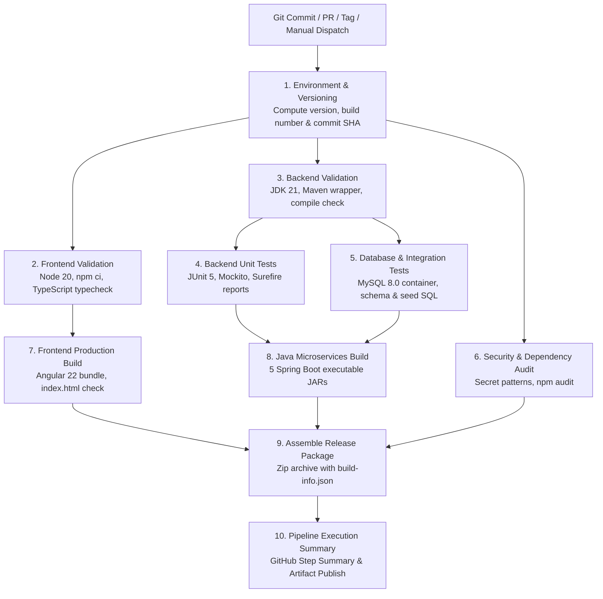

# AI Learning Tracker — CI/CD Pipeline Architecture & Operations Manual

This document provides complete technical documentation for the **GitHub Actions Continuous Integration & Continuous Delivery (CI/CD) Pipeline** powering the AI Learning Tracker platform.

---

## 1. Pipeline Architecture Overview

The pipeline automates end-to-end validation, testing, security auditing, container/service builds, artifact assembly, and package publishing for the Angular 22 frontend and Java 21 Spring Boot microservices.



---

## 2. Trigger Conditions & Concurrency Controls

The workflow file [`.github/workflows/ci-cd.yml`](./ci-cd.yml) responds to four operational triggers:

| Trigger | Events / Branches / Filters | Purpose |
|---|---|---|
| **Push** | `branches: [ main, master, develop ]` | Validates every direct commit or merge, builds all components, and generates release/nightly packages. |
| **Tags** | `tags: [ 'v*.*.*' ]` | Triggers official semantic release builds with clean version identifiers (e.g., `v1.2.0` produces `1.2.0`). |
| **Pull Request** | `branches: [ main, master, develop ]` | Validates candidate branch changes before merging, running all tests, type checks, and quality gates. |
| **Manual Dispatch** | `workflow_dispatch` with parameter `skip_security_scan` | Allows developers to manually test and generate reproducible release packages on demand. |

### Concurrency Protection
```yaml
concurrency:
  group: ${{ github.workflow }}-${{ github.ref }}
  cancel-in-progress: ${{ github.event_name == 'pull_request' }}
```
- For Pull Requests: Obsolete in-progress builds are automatically cancelled when new commits are pushed, conserving CI minutes.
- For `main`/`develop` pushes: Runs proceed to completion to preserve build history and artifact continuity.

---

## 3. Technology Stack & Runtime Specifications

| Component | Technology | Version | Location in Repository |
|---|---|---|---|
| **Frontend UI** | Angular CLI / Standalone Components | `22.2.0` (CLI `22.2.1`) | [`frontend/`](../../frontend/) |
| **Frontend Runtime** | Node.js / npm | Node `20.x` / npm `10.x` / `12.x` | [`frontend/package.json`](../../frontend/package.json) |
| **Styling & Icons** | Tailwind CSS / Lucide Angular | `3.4.19` / `1.51.0` | [`frontend/tailwind.config.js`](../../frontend/tailwind.config.js) |
| **Backend Runtime** | Java OpenJDK (Temurin) | `21-LTS` | [`backend/pom.xml`](../../backend/pom.xml) |
| **Backend Framework** | Spring Boot | `3.3.4` | [`backend/pom.xml`](../../backend/pom.xml) |
| **Cloud Discovery** | Spring Cloud Netflix Eureka | `2023.0.3` | [`backend/discovery-server/`](../../backend/discovery-server/) |
| **API Gateway** | Spring Cloud Gateway (Reactive) | `2023.0.3` | [`backend/gateway-service/`](../../backend/gateway-service/) |
| **Microservices** | Auth, Learning, Tools & News | Spring Boot `3.3.4` | [`backend/`](../../backend/) |
| **Auxiliary Service**| Node.js Social Image Service | Express / Sharp | [`backend/social-image-service/`](../../backend/social-image-service/) |
| **Relational DB** | MySQL Server | `8.0` | [`database/`](../../database/) |
| **Build Wrapper** | Apache Maven Wrapper (`mvnw`) | `3.9.9` | [`backend/mvnw`](../../backend/mvnw) |

---

## 4. Pipeline Jobs & Quality Gates

### Job 1: `prepare` (Environment & Versioning)
- Determines semantic version from `backend/pom.xml`.
- Computes build identifier (`<version>-build.<run_number>-<short_sha>`).
- Tags release builds when triggered from a git tag (`refs/tags/v*`).
- Exports outputs for downstream artifact naming.

### Job 2: `frontend-validation` (Angular & TypeScript)
- Checks out repository.
- Sets up Node.js 20 with cache keyed to `frontend/package-lock.json`.
- Executes reproducible installation via `npm ci`.
- Runs TypeScript static type checking: `npm run typecheck` (`tsc --noEmit`).
- Verifies Angular configuration integrity (`angular.json`, `src/main.ts`).

### Job 3: `backend-validation` (Java Microservices)
- Sets up Eclipse Temurin JDK 21 with Maven dependency caching.
- Validates `./mvnw` execution and file permissions.
- Compiles parent and all 5 microservice modules: `./mvnw -B clean compile -DskipTests`.

### Job 4: `unit-tests` (Backend Testing)
- Executes all JUnit 5 and Mockito test suites across all modules: `./mvnw -B test`.
- Captures test results across `discovery-server`, `gateway-service`, `auth-service`, `learning-service`, and `tools-news-service`.
- In all scenarios (`if: always()`), uploads Surefire XML/TXT reports as the `surefire-test-reports` artifact for inspection.

### Job 5: `integration-tests` (MySQL 8.0 Database Container)
- Spawns a dedicated MySQL 8.0 service container with health checks.
- Initializes database schemas using [`database/schema.sql`](../../database/schema.sql).
- Injects seed data from [`database/seed.sql`](../../database/seed.sql).
- Verifies table schemas, foreign keys, and migration scripts across `ai_auth_db`, `ai_learning_db`, and `ai_tools_news_db`.

### Job 6: `security-scan` (SAST & Vulnerability Auditing)
- Audits repository tree for hardcoded secrets, private keys, or cloud credentials.
- Executes `npm audit --omit=dev --audit-level=critical` on production dependencies.

### Job 7: `frontend-build` (Angular Production Packaging)
- Compiles production Angular bundle: `npm run build` (`ng build`).
- Validates production bundle output in `dist/frontend-angular/browser/` (verifies `index.html`, JavaScript bundles, CSS stylesheets).
- Publishes intermediate artifact `frontend-dist`.

### Job 8: `microservices-build` (Spring Boot Packaging)
- Depends on passing tests (`unit-tests` and `integration-tests`).
- Packages all 5 Spring Boot microservices into executable fat JARs: `./mvnw -B package -DskipTests`.
- Verifies non-zero byte size and executable manifest for each JAR.
- Stages and uploads intermediate artifact `backend-jars`.

### Job 9: `package-application` (Release Assembly)
- Downloads intermediate frontend and backend artifacts.
- Stages all required components into a clean, reproducible folder hierarchy:
  - Frontend production build (`angular-dist/`)
  - 5 Spring Boot microservice JARs (`discovery-server.jar`, `gateway-service.jar`, `auth-service.jar`, `learning-service.jar`, `tools-news-service.jar`)
  - Node.js auxiliary service (`social-image-service/`)
  - Database DDL schemas, seed scripts, and migration deltas (`database/`)
  - Docker Compose file and microservice Dockerfiles (`deployment/docker/`)
  - Kubernetes deployment manifests and configmaps (`deployment/kubernetes/`)
  - System documentation (`documentation/`)
  - Comprehensive build metadata (`build-info.json`)
- Compresses package into `application-build-<version>.zip`.
- Uploads final package artifact with 30-day retention.

### Job 10: `pipeline-summary` (Executive Dashboard)
- Runs conditionally `if: always()` after all jobs finish.
- Publishes a formatted Markdown dashboard directly into the GitHub Actions run summary (`$GITHUB_STEP_SUMMARY`).

---

## 5. Security & Secret Management

1. **Least-Privilege Permissions**:
   ```yaml
   permissions:
     contents: read
     checks: write
     pull-requests: write
   ```
   The workflow explicitly grants read-only token permissions, elevating only where necessary for checks and pull-request comments.
2. **Zero Secrets in Code**: No API keys, database passwords, or JWT secrets are hardcoded in workflows or manifests.
3. **Isolated Test Database**: CI uses an ephemeral GitHub Actions service container with disposable credentials (`admin1234`), entirely disconnected from developer or production databases.
4. **No Secrets in Frontend**: Angular client code is built with public environment variables only; sensitive credentials remain strictly within backend environments.

---

## 6. Structure of the Packaged Artifact

When you download `application-build-<version>.zip`, it contains:

```text
application-build-1.0.0-build.42-a1b2c3d/
├── frontend/
│   └── angular-dist/
│       ├── index.html
│       ├── main-*.js
│       ├── styles-*.css
│       └── assets/
│
├── services/
│   ├── discovery-server.jar
│   ├── gateway-service.jar
│   ├── auth-service.jar
│   ├── learning-service.jar
│   ├── tools-news-service.jar
│   └── social-image-service/
│       ├── server.js
│       ├── package.json
│       └── package-lock.json
│
├── database/
│   ├── schema.sql
│   ├── seed.sql
│   ├── google_ai_delta.sql
│   ├── news_delta.sql
│   └── social_delta.sql
│
├── deployment/
│   ├── docker/
│   │   ├── docker-compose.yml
│   │   ├── Dockerfile.frontend
│   │   ├── Dockerfile.discovery-server
│   │   ├── Dockerfile.gateway-service
│   │   ├── Dockerfile.auth-service
│   │   ├── Dockerfile.learning-service
│   │   ├── Dockerfile.tools-news-service
│   │   └── nginx.conf
│   └── kubernetes/
│       ├── configmap.yaml
│       ├── discovery-deployment.yaml
│       ├── frontend-deployment.yaml
│       ├── gateway-deployment.yaml
│       ├── microservices-deployment.yaml
│       ├── mysql-deployment.yaml
│       └── mysql-init-configmap.yaml
│
├── documentation/
│   ├── 01-SRS.md
│   ├── 02-SDD.md
│   ├── 03-Architecture.md
│   └── ...
│
├── README.md
└── build-info.json
```

### Build Metadata Specification (`build-info.json`)
```json
{
  "application": "ai-learning-tracker",
  "version": "1.0.0-build.42-a1b2c3d",
  "gitCommit": "a1b2c3d4e5f6...",
  "shortCommit": "a1b2c3d",
  "branch": "main",
  "buildNumber": 42,
  "buildTimestamp": "2026-10-04T12:35:00Z",
  "isRelease": false,
  "runtimes": {
    "java": "21",
    "node": "20",
    "springBoot": "3.3.4",
    "angular": "22.2.0"
  },
  "services": [
    "discovery-server",
    "gateway-service",
    "auth-service",
    "learning-service",
    "tools-news-service",
    "social-image-service",
    "frontend-angular"
  ]
}
```

---

## 7. Local Build & Test Reproducibility Guide

Developers can replicate the exact CI build steps locally using these commands:

### Prerequisites
- **JDK 21** (`java -version` should report 21)
- **Node.js 20.x** & **npm**
- **Docker & Docker Compose** (for database and full stack testing)

### Step 1: Frontend Build & Type Validation
```bash
cd frontend

# Reproducible dependency installation
npm ci

# Static type verification
npm run typecheck

# Production build
npm run build
```

### Step 2: Backend Compilation & Unit Tests
```bash
cd backend

# Compile all modules
./mvnw clean compile -DskipTests

# Run all 22 unit tests across microservices
./mvnw test

# Package executable JARs
./mvnw package -DskipTests
```
*(On Windows PowerShell, use `.\mvnw.cmd` instead of `./mvnw`)*

### Step 3: Database & Local Integration Verification
```bash
# Start MySQL container using docker-compose
docker compose up -d mysql-db

# Check MySQL health
docker compose ps mysql-db

# Run full local application stack
docker compose up --build
```

---

## 8. Failure Triage & Troubleshooting Guide

| Failure Scenario | Typical Root Cause | Recommended Action |
|---|---|---|
| **Frontend `typecheck` fails** | TypeScript type error or missing interface property | Run `npm run typecheck` locally inside `frontend/` to view exact line numbers and TypeScript error codes (`TSxxxx`). |
| **Frontend build fails** | Bundle size budget exceeded or bad import in `angular.json` | Check the bundle size warning/error limits in [`frontend/angular.json`](../../frontend/angular.json#L58-L70). |
| **Backend `compile` fails with missing symbols** | Lombok annotation processor mismatch | Ensure JDK 21 is set in `JAVA_HOME`. Check that [`backend/pom.xml`](../../backend/pom.xml) includes the `annotationProcessorPaths` for `org.projectlombok:lombok`. |
| **Backend `unit-tests` fails** | Assertion failure in service test or Mockito mock setup | Download the `surefire-test-reports` artifact from the GitHub Actions run page, inspect the failed `.txt` dump, and run `./mvnw test -pl <failing-module>` locally. |
| **Database `integration-tests` fails** | Syntax error in `database/*.sql` or schema constraint violation | Test `mysql < database/schema.sql` against a local test container to identify the failing SQL statement. |
| **`security-scan` fails** | High or Critical CVE in dependencies or unmasked credential in PR | Run `npm audit` or inspect the secret scan log to locate any accidentally committed keys. |
| **`package-application` fails** | Missing JAR file from one of the microservice targets | Verify that all 5 services build their JARs in their respective `target/` directories without naming discrepancies. |

---

## 9. Release Process & Semantic Versioning

To publish an official release:

1. **Ensure branch is up-to-date**:
   ```bash
   git checkout main
   git pull origin main
   ```
2. **Create and push a semantic git tag**:
   ```bash
   git tag -a v1.0.0 -m "Release v1.0.0: Full Angular 22 & Spring Boot 3.3.4 Microservices"
   git push origin v1.0.0
   ```
3. **Pipeline Action**:
   - The tag trigger activates automatically.
   - Computes `version: 1.0.0` (with `isRelease: true`).
   - Publishes `application-build-1.0.0.zip` ready for production deployment or staging rollout.
