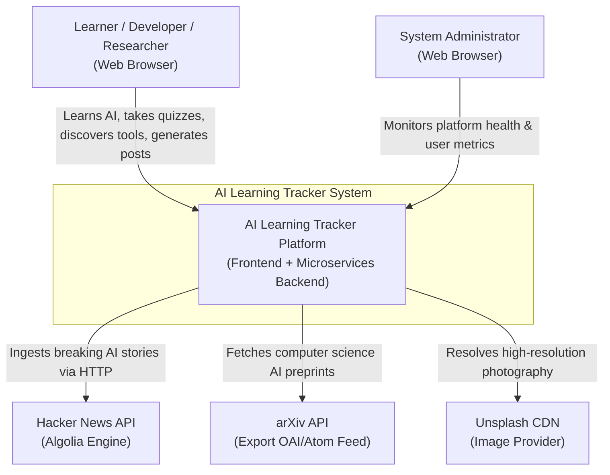
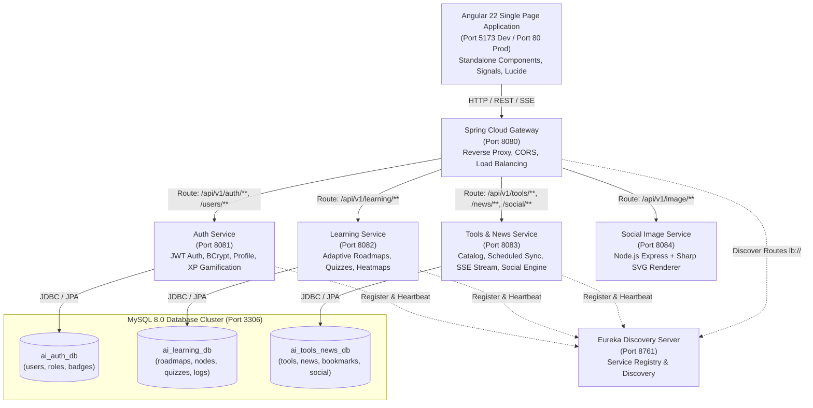
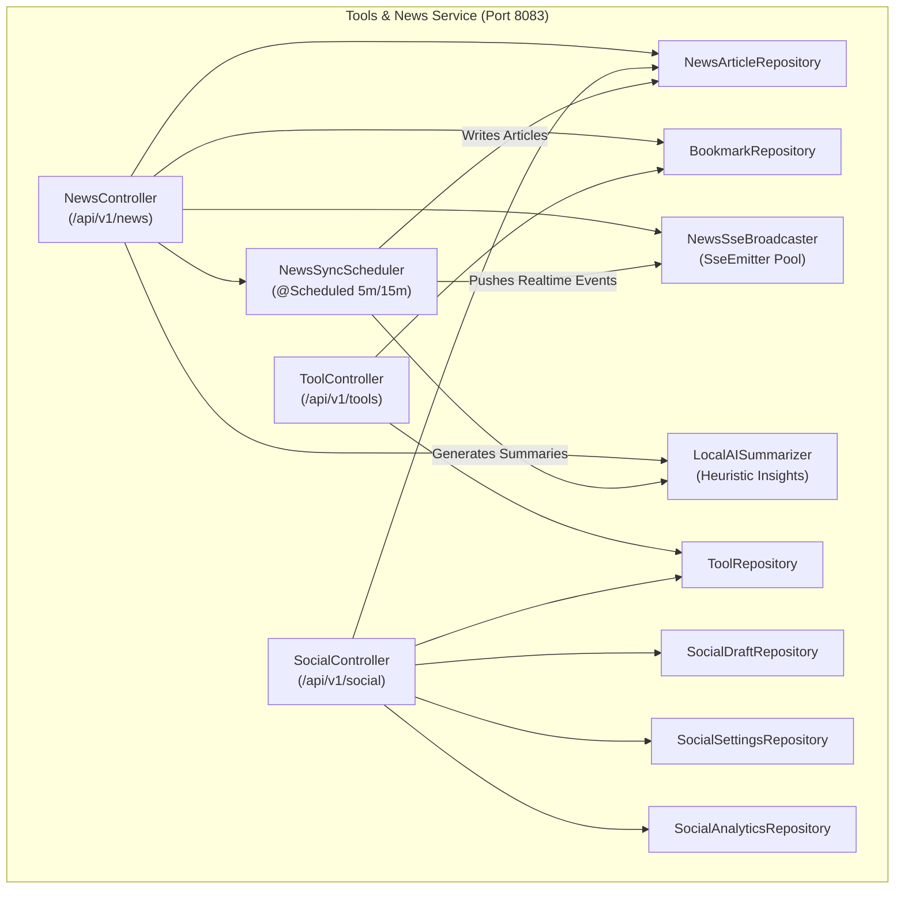
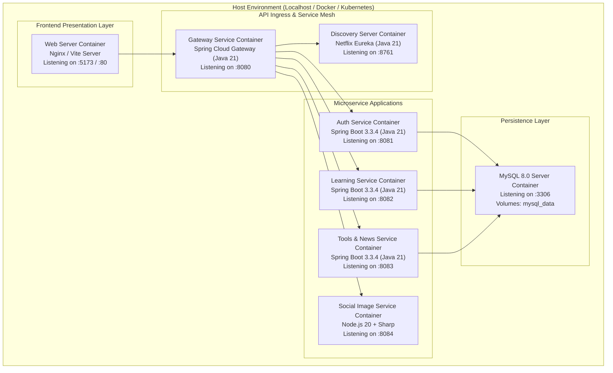

# System Architecture – AS-IS Architecture

**Project:** AI Learning Tracker & Ecosystem Hub  
**Document ID:** ARCH-AS-IS-003  
**Architecture Style:** Polyglot Distributed Microservices Architecture  
**System Status:** Implemented & Operational  
**Analysis Date:** October 2026  

---

## 1. Architecture Style & Classification

Based on empirical source code inspection, the system is classified as a **Polyglot Distributed Microservices Architecture** with a decoupled single-page application frontend.

### Evidence from Implementation:
1. **Independent Deployable Units:** Five separate Spring Boot Maven modules with individual packaging plugins, plus one Node.js microservice (`social-image-service`), and one decoupled Angular frontend (`frontend/`).
2. **Dynamic Service Registry:** Spring Cloud Netflix Eureka (`discovery-server`) running independently on port 8761 to handle service registration and heartbeats.
3. **API Gateway & Reverse Proxy:** Spring Cloud Gateway (`gateway-service`) running on port 8080 providing centralized ingress, CORS policy enforcement, path-based routing, and client load-balancing (`lb://`).
4. **Database-per-Domain Pattern:** Three distinct logical MySQL databases:
   - `ai_auth_db` for identity and gamification
   - `ai_learning_db` for roadmaps, daily study logs, and quizzes
   - `ai_tools_news_db` for tools, news feeds, bookmarks, and social marketing
5. **Polyglot Auxiliary Worker:** A specialized Node.js/Express service utilizing the libvips-backed `sharp` image engine for CPU-intensive vector-to-raster graphic conversions.

---

## 2. System Context Diagram (C4 Level 1)



---

## 3. Container Diagram (C4 Level 2)



---

## 4. Component Diagram: Tools & News Service (C4 Level 3)



---

## 5. Deployment Diagram (Infrastructure & Runtime)



---

## 6. End-to-End Data Flow Diagram (DFD)

### Ingestion & Real-Time Delivery Data Flow
```text
[External News APIs] ──► [NewsSyncScheduler (HTTP GET)]
                                 │
                                 ▼
                     [Deduplication Hash Check]
                                 ├── (Duplicate) ──► Merge alternative links & boost scores
                                 └── (New)       ──► Ingest, tag company, generate AI insights
                                 │
                                 ▼
                     [Save to ai_tools_news_db]
                                 │
                                 ▼
                     [NewsSseBroadcaster]
                                 │ (Server-Sent Event push)
                                 ▼
                     [Connected Angular Browser Clients]
```

### Learning Completion & Gamification Data Flow
```text
[User passes Quiz (>=70%)] ──► [RoadmapController (/quiz/submit)]
                                         │
                                         ▼
                             [Update node.status = 'COMPLETED']
                             [Update daily_logs with +300 XP]
                                         │
                                         ▼
                             [Trigger /api/v1/users/xp (+300)]
                                         │
                                         ▼
                             [Recalculate Level: 1 + floor(XP/1000)]
                             [Evaluate Badge Unlocks]
                                         │
                                         ▼
                             [Save ai_auth_db.users & return Level-Up toast]
```
