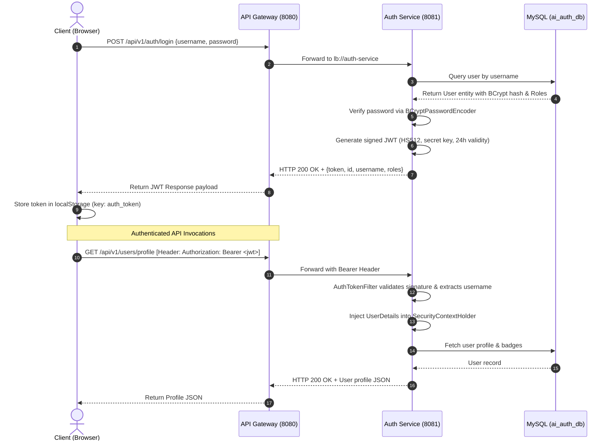

# High-Level Design (HLD) – Existing System

**Project:** AI Learning Tracker & Ecosystem Hub  
**Document ID:** HLD-AS-IS-004  
**System Status:** Implemented & Operational  
**Analysis Date:** October 2026  

---

## 1. System Components & Responsibilities

| Component Name | Technology Stack | Primary Responsibilities | Direct Dependencies | Exposed Interfaces |
|---|---|---|---|---|
| **Frontend UI** | Angular 22, TypeScript, Tailwind CSS, Lucide | User interaction, responsive views, state signals, offline simulation fallback, reactive charts, and modals. | API Gateway (HTTP), Browser LocalStorage | Web Application on Port 5173 (Dev) / Port 80 (Prod) |
| **API Gateway** | Spring Cloud Gateway, Netty | Ingress proxying, URL path routing, global CORS handling, client-side load balancing via Eureka (`lb://`). | Discovery Server | Reactive HTTP Gateway on Port 8080 |
| **Discovery Server** | Spring Cloud Netflix Eureka | Dynamic registry of service instances, health heartbeat tracking, service location lookup. | None (Standalone Registry) | Eureka Dashboard & API on Port 8761 |
| **Auth Service** | Spring Boot 3.3.4, Spring Security, Hibernate | User registration, credential authentication, JWT token signing, user profile, onboarding, and XP gamification. | Discovery Server, MySQL (`ai_auth_db`) | REST Endpoints on Port 8081 (`/api/v1/auth`, `/api/v1/users`) |
| **Learning Service** | Spring Boot 3.3.4, Spring Data JPA | Curriculum generation, roadmap node lifecycle, quizzes, scoring, daily study logging, and analytics aggregation. | Discovery Server, MySQL (`ai_learning_db`) | REST Endpoints on Port 8082 (`/api/v1/learning`) |
| **Tools & News Service** | Spring Boot 3.3.4, Spring Scheduling, SSE | Catalog of AI tools, automated external news ingestion, title deduplication, AI insight generation, SSE broadcasting, social post authoring. | Discovery Server, MySQL (`ai_tools_news_db`), Hacker News API, arXiv API | REST & SSE Endpoints on Port 8083 (`/api/v1/tools`, `/news`, `/social`) |
| **Social Image Service** | Node.js 20, Express, Sharp, libvips | Server-side vector template SVG assembly, raster conversion to PNG/JPEG with custom typography and brand gradients. | None (Stateless Node Worker) | REST Endpoint on Port 8084 (`/api/v1/image/render`) |
| **Relational Database** | MySQL 8.0 Server | Persistent storage of user profiles, learning roadmaps, quizzes, study heatmaps, tool catalogs, articles, bookmarks, and drafts. | File Storage Volume (`mysql_data`) | JDBC on Port 3306 |

---

## 2. Authentication & Authorization Workflow

The application implements a stateless **JSON Web Token (JWT)** security architecture.

---

## 3. Major Business Workflows

### Workflow 1: Adaptive Learning Path Generation
1. **Trigger:** Learner completes onboarding questionnaire or clicks "Generate Roadmap".
2. **Execution:** `RoadmapService.generateRoadmap()` evaluates the user's `goal` parameter:
   - If `ML Engineer` / `AI Researcher`: Scaffolds Classical ML, Deep Learning, PyTorch, Computer Vision/NLP, and MLOps deployment.
   - If `Gemini Ecosystem`: Scaffolds Gemini API, Prompt Engineering, Gemini Multimodal, RAG with Vertex AI, Gemma local inference, and Gemini Agents.
   - If `Generative AI Engineer`: Scaffolds Prompt Engineering, Vector Databases (Pinecone/Milvus), LangChain/LlamaIndex, RAG Systems, Multi-Agent Teams (CrewAI), and LLMOps.
   - Otherwise: Scaffolds Generalist AI pathway.
3. **Persistence:** Cleans previous roadmap records and saves sequenced `LearningNode` entities with estimated hours and difficulties.

### Workflow 2: Automated Breaking News Ingestion & Real-Time Broadcast
1. **Trigger:** Spring `@Scheduled` cron/rate triggers every 5 minutes (trending) and 15 minutes (general).
2. **Extraction:** `NewsSyncScheduler` queries Hacker News Algolia API (`https://hn.algolia.com/api/v1/search_by_date?tags=story&query=AI`) and arXiv API.
3. **Deduplication:** Normalizes article titles into alphanumeric strings and generates a hash key.
   - If hash exists: Merges URL into `alternative_references` JSON array and increments trending score.
   - If new: Assigns company classification (Google AI, DeepMind, Gemini, OpenAI, Anthropic, Meta, etc.), generates heuristic AI takeaways via `LocalAISummarizer`, and saves to `ai_tools_news_db.news_articles`.
4. **Push Notification:** Invokes `NewsSseBroadcaster.broadcastArticle(saved)` which sends the JSON payload to all active browser `SseEmitter` subscriptions connected to `/api/v1/news/stream`.

### Workflow 3: Social Content Generation & High-Resolution Image Rendering
1. **Trigger:** User chooses an AI tool or news story and opens the Social Studio.
2. **Text Generation:** `SocialController.generatePost()` takes input parameters (`type`, `id`, `tone`) and outputs structured sections (`hook`, `summary`, `insights`, `takeaway`, `cta`, `hashtags`, `fullContent`).
3. **Image Compilation:** Client requests graphic render via `POST /api/v1/image/render` on port 8084.
4. **Raster Processing:** `social-image-service` dynamically constructs an SVG canvas (applying selected theme: Gradient, Futuristic Grid, Slate, Glassmorphism, or Minimalist), executes text wrapping algorithms, and invokes `sharp()` to produce a 1200x628 PNG/JPEG binary buffer.

---

## 4. Scalability, Availability & Operational Characteristics

- **Stateless Microservices:** All business services (`auth-service`, `learning-service`, `tools-news-service`, `social-image-service`) are fully stateless. HTTP sessions are not stored in memory; all state is held in MySQL or transmitted in JWT tokens.
- **Dynamic Service Discovery:** Services register with Eureka upon startup. The API Gateway queries Eureka's registry rather than hardcoding IP addresses, enabling horizontal scale-out.
- **Fail-Safe Client Simulation Mode:** In local development or during backend outages, `learning.service.ts` detects connection failures (`TypeError: Failed to fetch`) and automatically transitions into simulation mode with mock data and local storage persistence.
