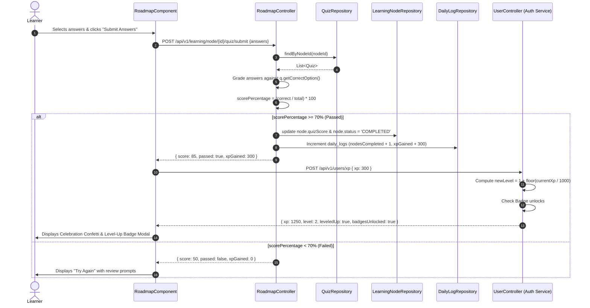
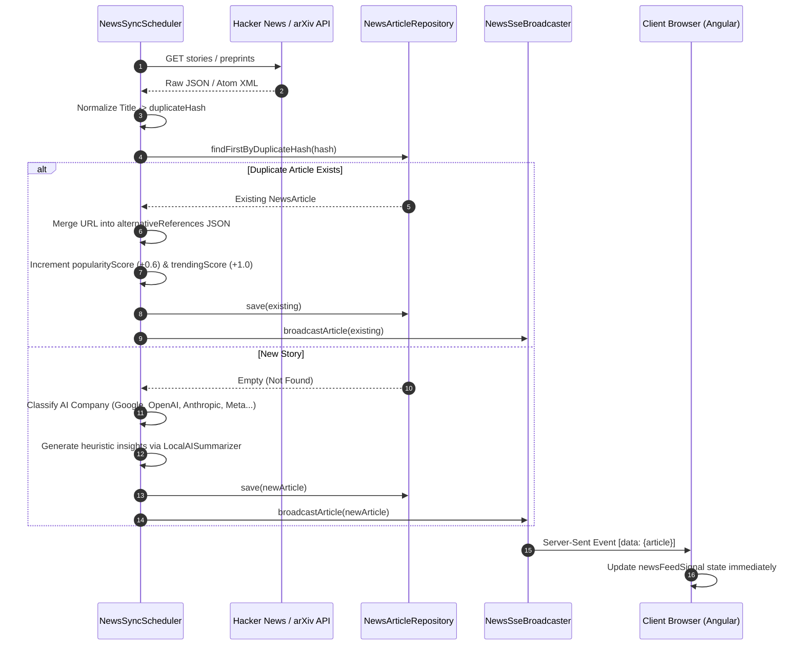

# Low-Level Design (LLD) – Existing Implementation

**Project:** AI Learning Tracker & Ecosystem Hub  
**Document ID:** LLD-AS-IS-005  
**System Status:** Implemented & Operational  
**Analysis Date:** October 2026  

---

## 1. Backend Service Layer Architectures

The backend follows Spring Boot's idiomatic **Controller $\to$ Service $\to$ Repository $\to$ Model** tiered architecture across each microservice.

```text
Controller Layer (@RestController)
       │ HTTP Request / Payload Parsing
       ▼
Service Layer (@Service)
       │ Business Rules, Deduplication, Algorithms
       ▼
Repository Layer (@Repository / JpaRepository)
       │ Hibernate / Spring Data Queries
       ▼
Domain Entity (@Entity) ──► MySQL Tables
```

---

## 2. Low-Level Component Hierarchy by Service

### 2.1 Auth Service (`com.ailearning.tracker.authservice`)

#### Controllers
- `AuthController`:
  - `authenticateUser(@RequestBody LoginRequest loginRequest): ResponseEntity<?>`
  - `registerUser(@RequestBody SignupRequest signUpRequest): ResponseEntity<?>`
- `UserController`:
  - `getUserProfile(): ResponseEntity<?>`
  - `submitOnboarding(@RequestBody OnboardingRequest request): ResponseEntity<?>`
  - `addXp(@RequestBody Map<String, Integer> payload): ResponseEntity<?>`
  - `getUserBadges(): ResponseEntity<?>`

#### Domain Entities
- `User`:
  - Properties: `id` (Long), `username` (String), `email` (String), `password` (String), `level` (int), `xp` (int), `streak` (int), `currentStreak` (int), `maxStreak` (int), `onboardingDone` (boolean), `skillLevel` (String), `background` (String), `learningGoal` (String), `hoursPerDay` (Double), `learningStyle` (String), `createdAt` (Timestamp), `updatedAt` (Timestamp).
  - Relationships:
    - `@ManyToMany Set<Role> roles` (Join table: `user_roles`)
    - `@ManyToMany Set<Badge> badges` (Join table: `user_badges`)
- `Role`: `id` (int), `name` (String: `ROLE_USER`, `ROLE_ADMIN`).
- `Badge`: `id` (int), `name` (String), `description` (String), `iconName` (String), `xpRequirement` (int).

#### Repositories
- `UserRepository extends JpaRepository<User, Long>`:
  - `Optional<User> findByUsername(String username)`
  - `Boolean existsByUsername(String username)`
  - `Boolean existsByEmail(String email)`
- `RoleRepository extends JpaRepository<Role, Integer>`:
  - `Optional<Role> findByName(String name)`
- `BadgeRepository extends JpaRepository<Badge, Integer>`:
  - `@Query("SELECT b FROM Badge b WHERE b.xpRequirement <= :xp") List<Badge> findEarnedBadges(@Param("xp") int xp)`

#### Security & Filters
- `SecurityConfig`: Configures `SecurityFilterChain`, disables CSRF, enforces `SessionCreationPolicy.STATELESS`, registers `AuthTokenFilter`, permits `/api/v1/auth/**`, requires authentication for `/api/v1/users/**`.
- `AuthTokenFilter extends OncePerRequestFilter`: Intercepts `Authorization: Bearer <token>`, validates via `JwtUtils.validateJwtToken()`, populates `SecurityContextHolder`.
- `JwtUtils`: Generates tokens with HMAC-SHA256, signs with `app.jwtSecret`, extracts claims, checks expiration against `app.jwtExpirationMs` (86,400,000 ms).

---

### 2.2 Learning Service (`com.ailearning.tracker.learningservice`)

#### Controllers
- `RoadmapController`:
  - `generateRoadmap(@RequestBody Map<String, Object> payload): ResponseEntity<?>`
  - `getRoadmap(@RequestParam Long userId): ResponseEntity<?>`
  - `updateNodeStatus(@PathVariable Long nodeId, @RequestBody Map<String, String> payload, @RequestParam Long userId): ResponseEntity<?>`
  - `getNodeQuiz(@PathVariable Long nodeId): ResponseEntity<?>`
  - `submitQuizAnswers(@PathVariable Long nodeId, @RequestBody Map<String, Map<Long, String>> payload, @RequestParam Long userId): ResponseEntity<?>`
  - `addCustomNode(@RequestBody Map<String, Object> payload): ResponseEntity<?>`
- `AnalyticsController`:
  - `getLogs(@RequestParam Long userId, @RequestParam LocalDate startDate, @RequestParam LocalDate endDate): ResponseEntity<?>`
  - `getAnalyticsSummary(@RequestParam Long userId): ResponseEntity<?>`

#### Services
- `RoadmapService`:
  - `generateRoadmap(Long userId, String skillLevel, String background, String goal, Double hoursPerDay, String learningStyle): Roadmap`
  - Encapsulates domain logic for curricula assembly (ML Engineer, Gemini Ecosystem, Generative AI, or Generalist).

#### Domain Entities
- `Roadmap`: `id` (Long), `userId` (Long), `skillLevel` (String), `background` (String), `goal` (String), `targetHoursPerDay` (Double), `learningStyle` (String), `estimatedCompletionWeeks` (int), `createdAt` (LocalDateTime), `@OneToMany List<LearningNode> nodes`.
- `LearningNode`: `id` (Long), `@ManyToOne Roadmap roadmap`, `title` (String), `description` (String), `difficulty` (String), `durationHours` (Double), `status` (String: `NOT_STARTED`, `IN_PROGRESS`, `COMPLETED`), `quizScore` (Integer), `completedAt` (LocalDateTime), `sequenceOrder` (int), `parentNodeId` (Long).
- `DailyLog`: `id` (Long), `userId` (Long), `logDate` (LocalDate), `hoursLearned` (Double), `nodesCompleted` (int), `xpGained` (int), `notes` (String). Unique on `(userId, logDate)`.
- `Quiz`: `id` (Long), `nodeId` (Long), `question` (String), `optionA` (String), `optionB` (String), `optionC` (String), `optionD` (String), `correctOption` (String: `A`, `B`, `C`, `D`).

---

### 2.3 Tools & News Service (`com.ailearning.tracker.toolsnewsservice`)

#### Controllers
- `ToolController`:
  - `getAllTools(@RequestParam String category, @RequestParam String search, @RequestParam String pricing): ResponseEntity<?>`
  - `getToolById(@PathVariable Long id): ResponseEntity<Tool>`
  - `createTool(@RequestBody Tool tool): ResponseEntity<Tool>`
  - `getFavorites(@RequestParam Long userId): ResponseEntity<?>`
  - `toggleFavorite(@PathVariable Long id, @RequestParam Long userId): ResponseEntity<?>`
- `NewsController`:
  - `getNews(@RequestParam String category, @RequestParam String company, @RequestParam String dateRange, @RequestParam Boolean trendingOnly, @RequestParam String search, @RequestParam int page, @RequestParam int size, @RequestParam String sortBy, @RequestParam String direction): ResponseEntity<?>`
  - `getNewsById(@PathVariable Long id): ResponseEntity<NewsArticle>`
  - `getAiSummary(@PathVariable Long id): ResponseEntity<?>`
  - `getSavedNews(@RequestParam Long userId): ResponseEntity<?>`
  - `toggleBookmark(@PathVariable Long id, @RequestParam Long userId): ResponseEntity<?>`
  - `triggerSync(): ResponseEntity<?>`
  - `streamNews(): SseEmitter`
- `SocialController`:
  - `getSettings(@RequestParam Long userId): ResponseEntity<SocialSettings>`
  - `saveSettings(@RequestBody SocialSettings settings): ResponseEntity<SocialSettings>`
  - `getDrafts(@RequestParam Long userId): ResponseEntity<List<SocialDraft>>`
  - `saveDraft(@RequestBody SocialDraft draft): ResponseEntity<SocialDraft>`
  - `deleteDraft(@PathVariable Long id): ResponseEntity<?>`
  - `getAnalyticsSummary(@RequestParam Long userId): ResponseEntity<?>`
  - `generatePost(@RequestBody Map<String, Object> request): ResponseEntity<?>`

#### Services & Background Workers
- `NewsSyncScheduler`:
  - `scheduledSyncTrending()`: Fixed rate 300,000ms (5 mins).
  - `scheduledSyncGeneral()`: Fixed rate 900,000ms (15 mins).
  - `performSync(): int`: Extracts from Hacker News Algolia API + arXiv cs.AI API + breaking news generator.
  - `processAndSaveArticle(NewsArticle article): boolean`: Hashes normalized title, tests for duplicates, merges URLs, generates insights, broadcasts via SSE.
- `NewsSseBroadcaster`:
  - Holds thread-safe `CopyOnWriteArrayList<SseEmitter> emitters`.
  - `registerEmitter(): SseEmitter` with 30-minute timeout.
  - `broadcastArticle(NewsArticle article)`: Serializes entity as JSON and pushes event `name: "NEWS_UPDATE"`.
- `LocalAISummarizer`:
  - Generates JSON string containing: `takeaways`, `beginner` explanation, `business` impact, `developer` impact, and `learning` prompt.

---

### 2.4 Social Image Service (`server.js`)

#### Architecture:
Node.js Express microservice on port 8084 utilizing `sharp` for fast SVG rasterization.

#### Internal Functions:
- `wrapText(text: string, maxCharsPerLine: number): string[]`: Tokenizes strings by whitespace and breaks lines based on available canvas width.
- `escapeXml(unsafe: string): string`: Sanitizes characters (`&`, `<`, `>`, `"`, `'`) for valid SVG XML serialization.
- `POST /api/v1/image/render`:
  1. Accepts dimensions and style props (`bannerSize`: linkedin, twitter, instagram, story, etc.).
  2. Injects vector geometry, linear/radial gradients, and CSS typography.
  3. Uses `sharp(svgBuffer).png({ compressionLevel: 8 })` or `.jpeg({ quality: 95 })`.
  4. Returns raw binary image buffer with `Content-Type: image/png` or `image/jpeg`.

---

## 3. Sequence Diagrams for Critical Workflows

### 3.1 Quiz Submission & XP / Level-Up Evaluation



### 3.2 News Ingestion, Deduplication, and SSE Broadcast


