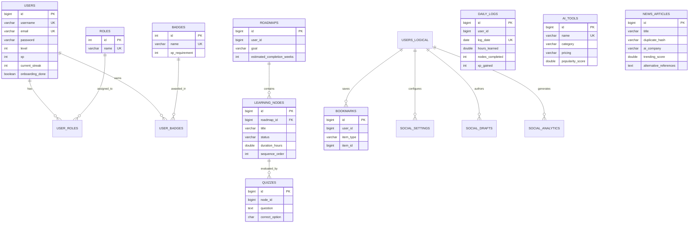

# Database Design – AS-IS Specification

**Project:** AI Learning Tracker & Ecosystem Hub  
**Document ID:** DBD-AS-IS-008  
**Database Engine:** MySQL 8.0 Community / Server  
**Architecture:** Database-per-Service (3 Logical Schemas)  
**System Status:** Implemented & Operational  
**Analysis Date:** October 2026  

---

## 1. Database Architecture & Schema Division

The application implements a **Database-per-Domain** architecture across three independent MySQL schemas hosted on the same MySQL instance (Port 3306):

1. **`ai_auth_db`:** User identity, authentication credentials, onboarding responses, levels, XP, and badges.
2. **`ai_learning_db`:** User roadmaps, curriculum sequence nodes, daily study logs for heatmaps, and quizzes.
3. **`ai_tools_news_db`:** AI tools directory, breaking news articles, user bookmarks, social settings, drafts, and analytics.

---

## 2. Entity-Relationship Diagram (ERD)



---

## 3. Data Dictionary

### 3.1 Schema: `ai_auth_db`

#### Table: `users`
| Column Name | Data Type | Nullable | Default | PK | FK | Description / Constraints |
|---|---|---|---|---|---|---|
| `id` | `BIGINT` | NO | Auto-Increment | YES | NO | Unique User Identifier |
| `username` | `VARCHAR(50)` | NO | None | NO | NO | Unique login handle (`UNIQUE`) |
| `email` | `VARCHAR(100)` | NO | None | NO | NO | Unique email address (`UNIQUE`) |
| `password` | `VARCHAR(120)` | NO | None | NO | NO | BCrypt-hashed password |
| `level` | `INT` | YES | `1` | NO | NO | Calculated player level |
| `xp` | `INT` | YES | `0` | NO | NO | Cumulative experience points |
| `streak` | `INT` | YES | `0` | NO | NO | Legacy streak counter |
| `current_streak`| `INT` | YES | `0` | NO | NO | Consecutive days active |
| `max_streak` | `INT` | YES | `0` | NO | NO | Best streak achieved |
| `onboarding_done`| `BOOLEAN` | YES | `FALSE` | NO | NO | Onboarding completion flag |
| `skillLevel` | `VARCHAR(20)` | YES | NULL | NO | NO | Self-reported level (Beginner, etc.) |
| `background` | `VARCHAR(30)` | YES | NULL | NO | NO | User professional background |
| `learning_goal` | `VARCHAR(30)` | YES | NULL | NO | NO | User goal (e.g. ML Engineer) |
| `hours_per_day` | `DOUBLE` | YES | `1.0` | NO | NO | Daily target learning time |
| `learning_style`| `VARCHAR(20)` | YES | NULL | NO | NO | Visual, hands-on, theoretical |
| `created_at` | `TIMESTAMP` | YES | `CURRENT_TIMESTAMP` | NO | NO | Record creation date |
| `updated_at` | `TIMESTAMP` | YES | `CURRENT_TIMESTAMP ON UPDATE` | NO | NO | Record update date |

#### Table: `roles`
| Column Name | Data Type | Nullable | Default | PK | FK | Description |
|---|---|---|---|---|---|---|
| `id` | `INT` | NO | Auto-Increment | YES | NO | Role identifier |
| `name` | `VARCHAR(20)` | NO | None | NO | NO | Role authority string (`ROLE_USER`, `ROLE_ADMIN`, `UNIQUE`) |

#### Table: `user_roles`
| Column Name | Data Type | Nullable | Default | PK | FK | Description |
|---|---|---|---|---|---|---|
| `user_id` | `BIGINT` | NO | None | YES | YES | FK to `users(id)` ON DELETE CASCADE |
| `role_id` | `INT` | NO | None | YES | YES | FK to `roles(id)` ON DELETE CASCADE |

#### Table: `badges`
| Column Name | Data Type | Nullable | Default | PK | FK | Description |
|---|---|---|---|---|---|---|
| `id` | `INT` | NO | Auto-Increment | YES | NO | Badge identifier |
| `name` | `VARCHAR(50)` | NO | None | NO | NO | Unique badge name |
| `description` | `VARCHAR(255)`| NO | None | NO | NO | Achievement unlock description |
| `icon_name` | `VARCHAR(50)` | NO | None | NO | NO | Lucide icon identifier |
| `xp_requirement`| `INT` | NO | None | NO | NO | Threshold XP required for award |

#### Table: `user_badges`
| Column Name | Data Type | Nullable | Default | PK | FK | Description |
|---|---|---|---|---|---|---|
| `user_id` | `BIGINT` | NO | None | YES | YES | FK to `users(id)` ON DELETE CASCADE |
| `badge_id` | `INT` | NO | None | YES | YES | FK to `badges(id)` ON DELETE CASCADE |
| `unlocked_at` | `TIMESTAMP` | YES | `CURRENT_TIMESTAMP` | NO | NO | Unlock timestamp |

---

### 3.2 Schema: `ai_learning_db`

#### Table: `roadmaps`
| Column Name | Data Type | Nullable | Default | PK | FK | Description |
|---|---|---|---|---|---|---|
| `id` | `BIGINT` | NO | Auto-Increment | YES | NO | Roadmap identifier |
| `user_id` | `BIGINT` | NO | None | NO | NO | Logical reference to `ai_auth_db.users.id` |
| `skill_level` | `VARCHAR(20)` | NO | None | NO | NO | Target skill level |
| `background` | `VARCHAR(30)` | NO | None | NO | NO | Target background |
| `goal` | `VARCHAR(30)` | NO | None | NO | NO | Career objective |
| `target_hours_per_day` | `DOUBLE` | YES | `1.0` | NO | NO | Planned study dedication |
| `learning_style` | `VARCHAR(20)` | NO | None | NO | NO | Style preference |
| `estimated_completion_weeks` | `INT` | YES | `12` | NO | NO | Target timeline |
| `created_at` | `TIMESTAMP` | YES | `CURRENT_TIMESTAMP` | NO | NO | Timestamp of generation |

#### Table: `learning_nodes`
| Column Name | Data Type | Nullable | Default | PK | FK | Description |
|---|---|---|---|---|---|---|
| `id` | `BIGINT` | NO | Auto-Increment | YES | NO | Node identifier |
| `roadmap_id` | `BIGINT` | NO | None | NO | YES | FK to `roadmaps(id)` ON DELETE CASCADE |
| `title` | `VARCHAR(100)`| NO | None | NO | NO | Module topic title |
| `description` | `TEXT` | NO | None | NO | NO | Curriculum details |
| `difficulty` | `VARCHAR(20)` | NO | None | NO | NO | `Beginner`, `Intermediate`, `Advanced` |
| `duration_hours` | `DOUBLE` | NO | None | NO | NO | Estimated study duration |
| `status` | `VARCHAR(20)` | YES | `'NOT_STARTED'` | NO | NO | `NOT_STARTED`, `IN_PROGRESS`, `COMPLETED` |
| `quiz_score` | `INT` | YES | NULL | NO | NO | Percentage score achieved on quiz |
| `completed_at` | `TIMESTAMP` | YES | NULL | NO | NO | Completion timestamp |
| `sequence_order` | `INT` | NO | None | NO | NO | Sequential rendering order |
| `parent_node_id` | `BIGINT` | YES | NULL | NO | NO | Self-referencing node hierarchy |

#### Table: `daily_logs`
| Column Name | Data Type | Nullable | Default | PK | FK | Description |
|---|---|---|---|---|---|---|
| `id` | `BIGINT` | NO | Auto-Increment | YES | NO | Log identifier |
| `user_id` | `BIGINT` | NO | None | NO | NO | Logical user reference |
| `log_date` | `DATE` | NO | None | NO | NO | Activity date (`UNIQUE(user_id, log_date)`) |
| `hours_learned` | `DOUBLE` | YES | `0.0` | NO | NO | Study hours accumulated |
| `nodes_completed`| `INT` | YES | `0` | NO | NO | Modules finished |
| `xp_gained` | `INT` | YES | `0` | NO | NO | Daily XP earned |
| `notes` | `TEXT` | YES | NULL | NO | NO | Free-text study notes |

#### Table: `quizzes`
| Column Name | Data Type | Nullable | Default | PK | FK | Description |
|---|---|---|---|---|---|---|
| `id` | `BIGINT` | NO | Auto-Increment | YES | NO | Quiz identifier |
| `node_id` | `BIGINT` | NO | None | NO | NO | Target learning node reference |
| `question` | `TEXT` | NO | None | NO | NO | Assessment question |
| `option_a` | `VARCHAR(255)`| NO | None | NO | NO | Option A text |
| `option_b` | `VARCHAR(255)`| NO | None | NO | NO | Option B text |
| `option_c` | `VARCHAR(255)`| NO | None | NO | NO | Option C text |
| `option_d` | `VARCHAR(255)`| NO | None | NO | NO | Option D text |
| `correct_option` | `CHAR(1)` | NO | None | NO | NO | Correct answer key (`A`, `B`, `C`, `D`) |

---

### 3.3 Schema: `ai_tools_news_db`

#### Table: `ai_tools`
| Column Name | Data Type | Nullable | Default | PK | FK | Description |
|---|---|---|---|---|---|---|
| `id` | `BIGINT` | NO | Auto-Increment | YES | NO | Tool identifier |
| `name` | `VARCHAR(100)`| NO | None | NO | NO | Tool product name (`UNIQUE`) |
| `category` | `VARCHAR(50)` | NO | None | NO | NO | LLMs, AI Agents, Vector DBs, etc. |
| `description` | `TEXT` | NO | None | NO | NO | Feature overview |
| `website_link` | `VARCHAR(255)`| NO | None | NO | NO | Canonical website destination |
| `chatbot_link` | `VARCHAR(255)`| YES | NULL | NO | NO | Chatbot web app link |
| `playground_link`| `VARCHAR(255)`| YES | NULL | NO | NO | Interactive playground link |
| `api_docs_link`| `VARCHAR(255)`| YES | NULL | NO | NO | Documentation link |
| `pricing` | `VARCHAR(20)` | YES | `'FREE'` | NO | NO | `FREE`, `PAID`, `FREEMIUM`, `OPEN_SOURCE` |
| `features` | `TEXT` | YES | NULL | NO | NO | Comma-separated feature highlights |
| `tags` | `VARCHAR(255)`| YES | NULL | NO | NO | Search index tags |
| `popularity_score`| `DOUBLE` | YES | `0.0` | NO | NO | Popularity rating ($0.0 - 10.0$) |
| `community_rating`| `DOUBLE` | YES | `0.0` | NO | NO | User rating ($0.0 - 5.0$) |
| `github_link` | `VARCHAR(255)`| YES | NULL | NO | NO | Open source repo link |
| `created_at` | `TIMESTAMP` | YES | `CURRENT_TIMESTAMP` | NO | NO | Ingestion timestamp |

#### Table: `news_articles`
| Column Name | Data Type | Nullable | Default | PK | FK | Description |
|---|---|---|---|---|---|---|
| `id` | `BIGINT` | NO | Auto-Increment | YES | NO | Article identifier |
| `title` | `VARCHAR(255)`| NO | None | NO | NO | News headline |
| `summary` | `TEXT` | NO | None | NO | NO | Ingested executive summary |
| `ai_summary` | `TEXT` | YES | NULL | NO | NO | Local AI synthesized summary |
| `full_summary` | `TEXT` | YES | NULL | NO | NO | Complete article text if fetched |
| `source` | `VARCHAR(100)`| NO | None | NO | NO | Hacker News, arXiv, TechCrunch |
| `category` | `VARCHAR(50)` | NO | None | NO | NO | Categorical tag |
| `published_date` | `TIMESTAMP` | NO | None | NO | NO | Publication timestamp (`INDEX`) |
| `article_link` | `VARCHAR(255)`| NO | None | NO | NO | Primary URL destination |
| `tags` | `VARCHAR(255)`| YES | NULL | NO | NO | Searchable keywords |
| `author` | `VARCHAR(255)`| YES | `'AI Editor'` | NO | NO | Journalist / author |
| `fetched_at` | `TIMESTAMP` | YES | `CURRENT_TIMESTAMP` | NO | NO | Ingestion timestamp |
| `ai_company` | `VARCHAR(100)`| YES | `'Generic'` | NO | NO | Google AI, OpenAI, Anthropic, Meta |
| `sentiment` | `VARCHAR(50)` | YES | `'NEUTRAL'` | NO | NO | `POSITIVE`, `NEUTRAL`, `NEGATIVE` |
| `popularity_score`| `DOUBLE` | YES | `0.0` | NO | NO | Computed popularity |
| `trending_score` | `DOUBLE` | YES | `0.0` | NO | NO | Hotness score (`INDEX`) |
| `thumbnail_image`| `VARCHAR(555)`| YES | NULL | NO | NO | 16:9 card preview image URL |
| `article_image` | `VARCHAR(555)`| YES | NULL | NO | NO | Full banner preview image URL |
| `ai_insights` | `TEXT` | YES | NULL | NO | NO | JSON with takeaways, beginner, impact |
| `duplicate_hash`| `VARCHAR(255)`| YES | NULL | NO | NO | Normalized title hash (`INDEX`) |
| `alternative_references`| `TEXT` | YES | NULL | NO | NO | JSON array of secondary coverage links |

#### Table: `bookmarks`
| Column Name | Data Type | Nullable | Default | PK | FK | Description |
|---|---|---|---|---|---|---|
| `id` | `BIGINT` | NO | Auto-Increment | YES | NO | Bookmark identifier |
| `user_id` | `BIGINT` | NO | None | NO | NO | Logical user reference |
| `item_type` | `VARCHAR(10)` | NO | None | NO | NO | `'TOOL'` or `'NEWS'` |
| `item_id` | `BIGINT` | NO | None | NO | NO | Reference to `ai_tools.id` or `news_articles.id` |
| `saved_at` | `TIMESTAMP` | YES | `CURRENT_TIMESTAMP` | NO | NO | Timestamp (`UNIQUE(user_id, item_type, item_id)`) |

#### Table: `social_settings`
| Column Name | Data Type | Nullable | Default | PK | FK | Description |
|---|---|---|---|---|---|---|
| `id` | `BIGINT` | NO | Auto-Increment | YES | NO | Settings identifier |
| `user_id` | `BIGINT` | NO | None | NO | NO | Unique User ID (`UNIQUE`) |
| `brand_colors` | `VARCHAR(100)`| YES | `'#0284c7,#6366f1'` | NO | NO | Primary and secondary hex codes |
| `personal_logo` | `TEXT` | YES | NULL | NO | NO | Logo string or image URL |
| `name_signature`| `VARCHAR(100)`| YES | NULL | NO | NO | Post author sign-off |
| `writing_tone` | `VARCHAR(50)` | YES | `'Professional'` | NO | NO | Default generation tone |
| `preferred_hashtags`| `VARCHAR(255)`| YES | `'#AI #Tech'` | NO | NO | Standard appended hashtags |
| `image_template`| `VARCHAR(50)` | YES | `'Modern Gradient'`| NO | NO | Selected banner template style |
| `watermark_text`| `VARCHAR(100)`| YES | NULL | NO | NO | Image corner watermark text |

#### Table: `social_drafts`
| Column Name | Data Type | Nullable | Default | PK | FK | Description |
|---|---|---|---|---|---|---|
| `id` | `BIGINT` | NO | Auto-Increment | YES | NO | Draft identifier |
| `user_id` | `BIGINT` | NO | None | NO | NO | Creator user ID |
| `title` | `VARCHAR(255)`| NO | None | NO | NO | Draft working title |
| `content` | `TEXT` | NO | None | NO | NO | Full post text with hashtags |
| `ai_image_url` | `TEXT` | YES | NULL | NO | NO | Generated banner image link |
| `platforms` | `VARCHAR(100)`| YES | `'LINKEDIN'` | NO | NO | Target channels (`LINKEDIN`, `TWITTER`) |
| `tone` | `VARCHAR(50)` | YES | `'Professional'` | NO | NO | Generation tone utilized |
| `status` | `VARCHAR(20)` | YES | `'DRAFT'` | NO | NO | `'DRAFT'`, `'SCHEDULED'`, `'PUBLISHED'` |
| `scheduled_time`| `TIMESTAMP` | YES | NULL | NO | NO | Publication target time |

#### Table: `social_analytics`
| Column Name | Data Type | Nullable | Default | PK | FK | Description |
|---|---|---|---|---|---|---|
| `id` | `BIGINT` | NO | Auto-Increment | YES | NO | Event identifier |
| `user_id` | `BIGINT` | NO | None | NO | NO | User ID |
| `post_id` | `BIGINT` | YES | NULL | NO | NO | Associated post ID |
| `platform` | `VARCHAR(50)` | YES | `'LINKEDIN'` | NO | NO | Channel |
| `action_type` | `VARCHAR(50)` | NO | None | NO | NO | `'GENERATED'`, `'SHARED'`, `'SCHEDULED'`, `'DOWNLOADED'` |
| `created_at` | `TIMESTAMP` | YES | `CURRENT_TIMESTAMP` | NO | NO | Event timestamp |

---

## 4. Database Indexes & Query Optimizations

As documented in `database/news_delta.sql`, explicit performance indexes are configured:
```sql
CREATE INDEX idx_published_date ON news_articles (published_date DESC);
CREATE INDEX idx_category ON news_articles (category);
CREATE INDEX idx_ai_company ON news_articles (ai_company);
CREATE INDEX idx_trending ON news_articles (trending_score DESC);
CREATE INDEX idx_dup_hash ON news_articles (duplicate_hash);
```
These prevent full-table scans during frequent real-time querying, multi-filter dropdown sorting, and deduplication verification loops.

---

## 5. Observed Database Observations & Findings

1. **Logical Foreign Keys Across Database Boundaries:** `roadmaps.user_id`, `daily_logs.user_id`, and `bookmarks.user_id` hold logical references to `ai_auth_db.users.id`. Because these reside in different database schemas, relational foreign key constraints (`ON DELETE CASCADE`) are deliberately omitted at the RDBMS level to preserve microservice autonomy.
2. **JSON Columns in Text Datatypes:** Alternative news references (`alternative_references`) and AI insights (`ai_insights`) are stored as `TEXT` containing JSON strings rather than native MySQL `JSON` types, maintaining maximum backward compatibility across MySQL configurations.
