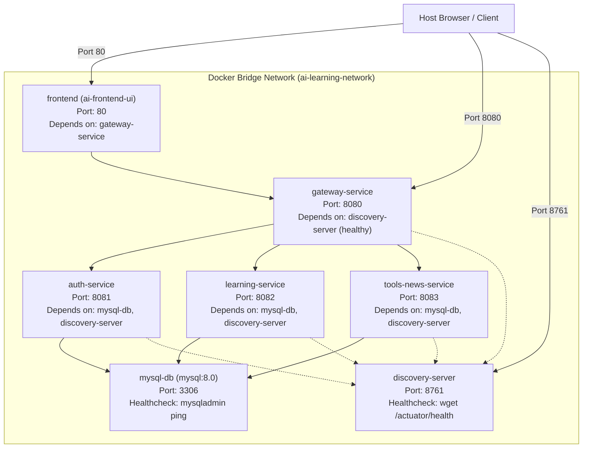

# Deployment Architecture – AS-IS Specification

**Project:** AI Learning Tracker & Ecosystem Hub  
**Document ID:** DEP-AS-IS-013  
**Target Environments:** Local Bare-Metal, Docker Compose, Kubernetes  
**System Status:** Implemented & Operational  
**Analysis Date:** October 2026  

---

## 1. Deployment Models & Environments

The codebase includes configurations for three distinct deployment workflows:

1. **Local Developer Orchestration (`run_app.bat` / `start_all.bat`):**
   - Windows native batch automation tool managing Java JARs, Node processes, and Vite dev servers directly on the developer's workstation.
2. **Containerized Multi-Service Stack (`docker-compose.yml`):**
   - Standardized 7-container Docker Compose definition with volume mounts, healthchecks, and dependency chains.
3. **Cloud-Native Kubernetes Cluster (`k8s/`):**
   - Production-ready declarative manifests for Deployments, ClusterIP/NodePort Services, ConfigMaps, and volume persistence.

---

## 2. Docker Compose Deployment Topology



### Key Orchestration Rules in `docker-compose.yml`:
- **Startup Sequencing (`condition: service_healthy`):** `auth-service`, `learning-service`, and `tools-news-service` block until `mysql-db` and `discovery-server` successfully pass their respective healthchecks.
- **Volume Mounts:** Persistent MySQL data stored in named volume `mysql_data:/var/lib/mysql`.
- **Database Initialization:** Auto-executes `1-schema.sql` and `2-seed.sql` on virgin database spins via `/docker-entrypoint-initdb.d/`.

---

## 3. Kubernetes Cluster Specification (`k8s/`)

The repository contains complete Kubernetes deployment specifications:

| Manifest File | Kind | Purpose in Existing Infrastructure |
|---|---|---|
| `k8s/configmap.yaml` | `ConfigMap` | Stores cluster-wide configuration: `EUREKA_SERVER_URL` (`http://discovery-server:8761/eureka/`) and MySQL host. |
| `k8s/mysql-init-configmap.yaml` | `ConfigMap` | Stores complete SQL initialization script for mounting inside MySQL container. |
| `k8s/mysql-deployment.yaml` | `Deployment`, `Service`, `PersistentVolumeClaim` | Deploys MySQL 8.0 pod with 5Gi volume claim and ClusterIP service on port 3306. |
| `k8s/discovery-deployment.yaml` | `Deployment`, `Service` | Deploys Eureka discovery server pod with ClusterIP service on port 8761. |
| `k8s/gateway-deployment.yaml` | `Deployment`, `Service` | Deploys reactive Spring Cloud Gateway with NodePort/ClusterIP service on port 8080. |
| `k8s/microservices-deployment.yaml`| `Deployment` (x3), `Service` (x3) | Deploys `auth-service` (8081), `learning-service` (8082), and `tools-news-service` (8083). |
| `k8s/frontend-deployment.yaml` | `Deployment`, `Service` | Deploys Angular Nginx web server with LoadBalancer/NodePort service on port 80. |

---

## 4. Local Automation Console (`run_app.bat`)

The developer control center script provides an interactive menu:
- `[1] Start Application`: Tests MySQL port 3306, frees conflicting ports (8761, 8080, 8081, 8082, 8083, 8084, 5173), starts Eureka (waiting 12s), starts backend microservices, starts Gateway, launches Social Image Service, and starts Vite/Angular UI in separate command prompts.
- `[2] Initialize & Seed Database`: Invokes `init_db.py` and `apply_delta.py`.
- `[3] Clean & Rebuild Backend Services`: Executes `mvn clean package -DskipTests`.
- `[4] Stop All Running Application Services`: Forcefully terminates processes listening on ports 8761, 8080, 8081, 8082, 8083, 8084, and 5173.

---

## 5. Continuous Integration (GitHub Actions)

File: `.github/workflows/ci-cd.yml`

```yaml
name: AI Learning Tracker CI/CD
on:
  push:
    branches: [ main, master ]
  pull_request:
    branches: [ main, master ]

jobs:
  backend-ci:
    name: Backend CI (Java 21 + Maven)
    runs-on: ubuntu-latest
    steps:
      - uses: actions/checkout@v4
      - uses: actions/setup-java@v4
        with:
          java-version: '21'
          distribution: 'temurin'
          cache: 'maven'
      - run: mvn -B clean test
        working-directory: ./backend

  frontend-ci:
    name: Frontend CI (Node 20 + Vite)
    runs-on: ubuntu-latest
    steps:
      - uses: actions/checkout@v4
      - uses: actions/setup-node@v4
        with:
          node-version: '20'
          cache: 'npm'
          cache-dependency-path: ./frontend/package-lock.json
      - run: npm ci
        working-directory: ./frontend
      - run: npm run build
        working-directory: ./frontend
```
Each pull request or merge to `main` verifies compilation, unit tests, and production frontend bundling.
