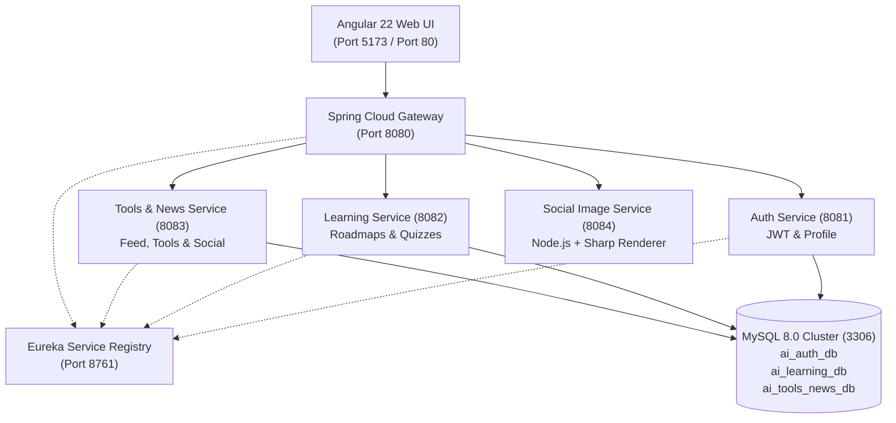

# AI Learning Tracker – Complete Software Documentation Suite

Welcome to the comprehensive, reverse-engineered **AS-IS Software Documentation Suite** for the **AI Learning Tracker & Ecosystem Hub**.

This documentation suite provides an architectural, operational, and code-traceable breakdown of the existing implementation, allowing software engineers, solution architects, devops specialists, and product leads to completely understand and operate the software without reading the entire codebase.

---

## 📚 Documentation Index

| File | Document Title | Primary Focus & Contents |
|---|---|---|
| [**01-SRS.md**](./01-SRS.md) | Software Requirements Specification | System purpose, existing functional requirements (FR-001 to FR-044), non-functional requirements (NFRs), user roles, and business rules. |
| [**02-Functional-Interface-Specification.md**](./02-Functional-Interface-Specification.md) | Functional & Interface Specification | Module-by-module analysis, inputs, outputs, UI components, business logic, and error scenarios for all 8 subsystems. |
| [**03-System-Architecture.md**](./03-System-Architecture.md) | System Architecture Specification | C4 System Context, Container, Component, Deployment, and End-to-End Data Flow diagrams. |
| [**04-High-Level-Design.md**](./04-High-Level-Design.md) | High-Level Design (HLD) | System component responsibilities, service boundaries, authentication flow sequence diagrams, and major business workflows. |
| [**05-Low-Level-Design.md**](./05-Low-Level-Design.md) | Low-Level Design (LLD) | Class diagrams, controller signatures, entities, repositories, background workers, and detailed execution sequence diagrams. |
| [**06-Frontend-Design.md**](./06-Frontend-Design.md) | Frontend Design Specification | Angular 22 architecture, standalone components, Angular Signals reactivity, page inventory, and offline simulation fallback mode. |
| [**07-Backend-Design.md**](./07-Backend-Design.md) | Backend Design Specification | Spring Boot 3.3.4, Java 21, Spring Cloud Gateway, Eureka Discovery, Sharp Node.js worker, and inter-service routing. |
| [**08-Database-Design.md**](./08-Database-Design.md) | Database Design Specification | Complete data dictionary across 3 MySQL schemas (`ai_auth_db`, `ai_learning_db`, `ai_tools_news_db`), ER diagram, indexes, and constraints. |
| [**09-API-Design.md**](./09-API-Design.md) | API Design Specification | Comprehensive REST and SSE API catalog, request/response payloads, pagination, status codes, and Postman traceability. |
| [**10-Security-Design.md**](./10-Security-Design.md) | Security Architecture | Stateless JWT authentication, BCrypt hashing, role-based access control, CORS configuration, and security risk assessment. |
| [**11-Integration-Design.md**](./11-Integration-Design.md) | Integration Design | Hacker News Algolia API, arXiv preprints API, Google Fonts CDN, Unsplash image CDN, and simulation engine fallback. |
| [**12-Technical-Design.md**](./12-Technical-Design.md) | Technical Design & Stack | Exact technology versions, build configuration management, and port allocation network matrix. |
| [**13-Deployment-Architecture.md**](./13-Deployment-Architecture.md) | Deployment Architecture | Local batch control center (`run_app.bat`), Docker Compose stack, Kubernetes cluster manifests (`k8s/`), and CI/CD pipeline. |
| [**14-Testing-Strategy.md**](./14-Testing-Strategy.md) | Testing Strategy & Audit | Unit tests (JUnit 5, Mockito), Spring Boot WebMvc tests, Postman collection automation, and coverage gap analysis. |
| [**15-Error-Handling.md**](./15-Error-Handling.md) | Error Handling Specification | Exception response payloads, HTTP status conventions, network timeout handling, and frontend in-app toast notifications. |
| [**16-Logging-Monitoring.md**](./16-Logging-Monitoring.md) | Logging & Monitoring | Spring Boot Logback, SQL query logging, Eureka dashboard monitoring, Docker healthchecks, and observability gaps. |
| [**17-Architecture-Decision-Records.md**](./17-Architecture-Decision-Records.md) | Architecture Decision Records | 8 formal ADRs documenting observed architecture choices, benefits, trade-offs, and operational risks. |
| [**18-Technical-Debt.md**](./18-Technical-Debt.md) | Technical Debt Analysis | Categorized technical debt items (Critical, High, Medium, Low) with concrete remediation plans. |
| [**19-Traceability-Matrix.md**](./19-Traceability-Matrix.md) | Requirements Traceability Matrix | End-to-end matrix mapping Requirements $\to$ UI $\to$ API $\to$ Controller $\to$ Service $\to$ Repository $\to$ Database $\to$ Test. |
| [**20-Architecture-Assessment.md**](./20-Architecture-Assessment.md) | Architecture Assessment | Multidimensional assessment (Security, Architecture, Database, Frontend, DevOps) with maturity radar and strategic roadmap. |

---

## 🏛️ System Architecture Summary

The **AI Learning Tracker** is architected as a **Polyglot Distributed Microservices Platform** fronted by a modern **Angular 22 Single-Page Application**:



---

## ⚡ Technology Stack at a Glance

- **Frontend:** Angular `22.2.0`, TypeScript `~6.0.2`, Tailwind CSS `^3.4.19`, Lucide Icons `^1.51.0`, `@angular/build` (esbuild + Vite).
- **Backend Core:** Java 21 LTS (Temurin), Spring Boot `3.3.4`, Spring Cloud `2023.0.3` (Gateway, Eureka), Spring Data JPA, Hibernate, Spring Security.
- **Backend Auxiliary:** Node.js 20 LTS, Express 4.x, Sharp `^0.33.x` (libvips C-bindings).
- **Persistence:** MySQL `8.0` with 3 partitioned logical database schemas.
- **Orchestration & DevOps:** Docker Compose (v3.8), Kubernetes (Deployments, Services, ConfigMaps, PVCs), GitHub Actions CI/CD (`.github/workflows/ci-cd.yml`), Windows CLI control center (`run_app.bat`).

---

## 🚀 Quick Start Guide

### 1. Local Bare-Metal (Recommended for Development)
Ensure MySQL is running on port 3306, then execute the interactive orchestrator:
```cmd
run_app.bat
```
Select `[1] Start Application` to launch all microservices and the Angular frontend in separate monitored terminal windows.

### 2. Containerized (Docker Compose)
```bash
docker-compose up --build -d
```
Access the application:
- **Web UI:** `http://localhost:80` (or `http://localhost:5173` for dev)
- **API Gateway:** `http://localhost:8080`
- **Eureka Registry:** `http://localhost:8761`

---

## 🔒 Security & Known Technical Debt

- **Authentication:** Stateless HMAC-SHA signed JWTs with 24-hour expiration.
- **Passwords:** Salted and hashed via BCrypt.
- **Key Technical Debt Item:** JWT secret key and root database passwords are hardcoded in `application.yml` and `docker-compose.yml`. Must be externalized to environment variables before deploying to public clouds (see [18-Technical-Debt.md](./18-Technical-Debt.md)).
